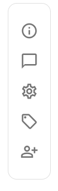
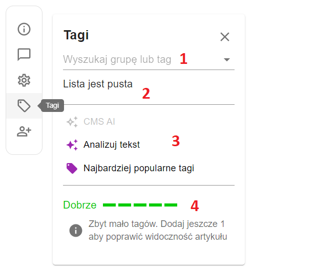
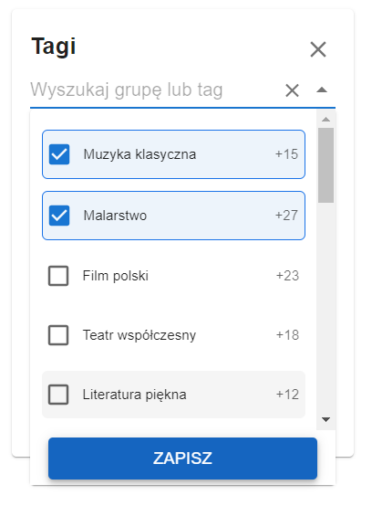
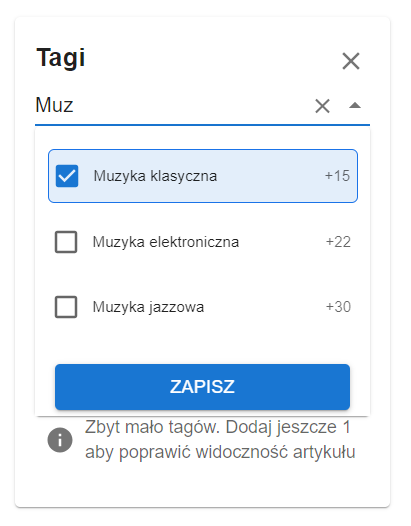
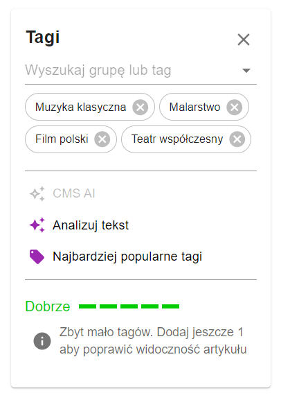
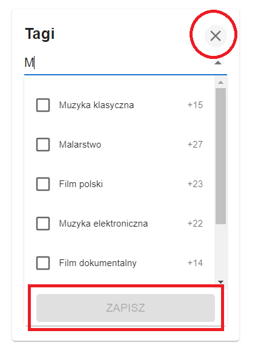

# tags-app
Prosta aplikacja służąca do dodawania tagów pod konkretny artykuł/wpis na blogu. Aplikacja przygotowana jest pod stworzenie nowych funkcjonalności.

## Instalacja zależności i bibliotek:
```bash
npm install
```

## Uruchomienie Aplikacji:
```bash
npm start
```

## Uruchomienie testów:
```bash
npm test
```

## Menu nawigacyjne:


Służy do przełączania nas pomiędzy dostępnymi sekcjami aplikacji.

## Głowny komponent aplikacji:


1. Inteligentny input z funkcjonalnością podpowiadania (autocomplete), wystarczy wpisać dowolne początkowe znaki aby wyświetlić listę interesujących nas tagów.
2. Lista wszystkich wybranych tagów, można je też usuwać.
3. Lista przycisków z dodatkowymi funkcjonalnościami (in progress).
4. Wskaźnik pokazujący odpowiednią ilość wybranych tagów (in progress).

## Lista z wybranymi tagami


Wszystkie wybrane już tagi zostają umieszczone na samej górze listy wszystkich tagów.

## Lista z wpisaną frazą i zaznaczonymi tagami


## Zapełniona sekcja z wybranymi konkretnymi tagami które zostały zapisane


## Zamykanie listy


Przycisk "Zapisz", zapisuje i zamyka okno listy tagów (należy wybrać przynajmniej 1 z tagów aby zapisać).
Przycisk "X" w górnym prawym rogu komponentu zamyka listę tagów.

